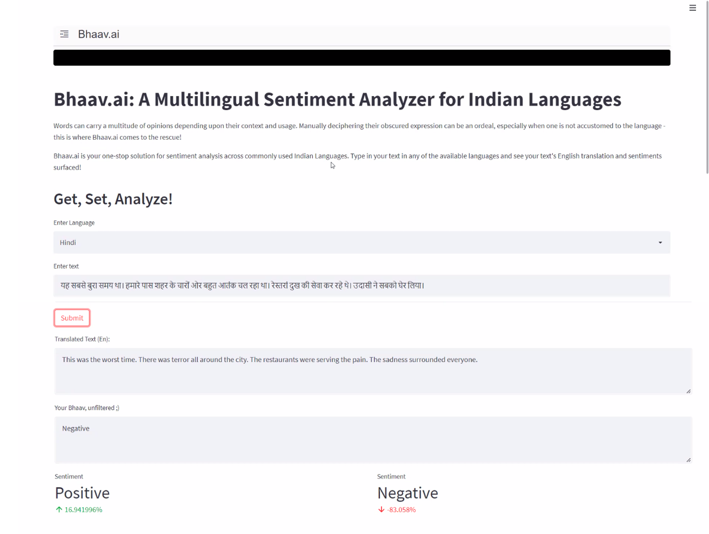
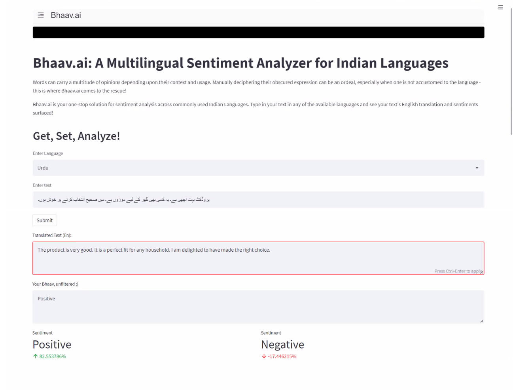

# Bhaav.ai
Bhaav.ai is a multilingual sentiment analyzer that focuses on the analysis of Indian Languages. Bhaav.ai, as a product in its present form, offers the analysis of the following languages: 

1. Hindi  
2. English  
3. Bengali  
4. Gujarati  
5. Malayalam  
6. Marathi  
7. Tamil  
8. Telugu  
9. Urdu  

The system takes the source language and the text to be analyzed as input from the user. Following this, it works in a two-fold process:
Translation of Input text from the source language to English. 
Sentiment analysis of English-translated text.

The positive and negative probabilities of the text are then displayed as the output, along with the translated text.

In the first part, the language translation is performed using the mbart-large-50-many-to-many-mmt model that was employed from Hugging Face.

In the second part, sentiment analysis is performed by an LSTM model that has been trained on a corpus of nearly 5000 text excerpts labelled as positive or negative.  

Finally, the system comes together with the UI that has been devised using streamlit.   

**Sample Use Case-1:**  
A text in Hindi was fed as an input to the system. The following depicts the output. Clearly, the dominant sentiment was found to be Negative.   

 
**Sample Use Case-2:**  
A text in Urdu was fed as an input to the system. The following depicts the output. Clearly, the dominant sentiment was found to be Positive.   

**Note:**   If the following error occurs while running FrontEnd.py:
"ImportError: cannot import name 'pad_sequences' from 'keras.preprocessing.sequence' ", please consider changing 'keras.preprocessing.sequence' to 'keras_preprocessing.sequence'
